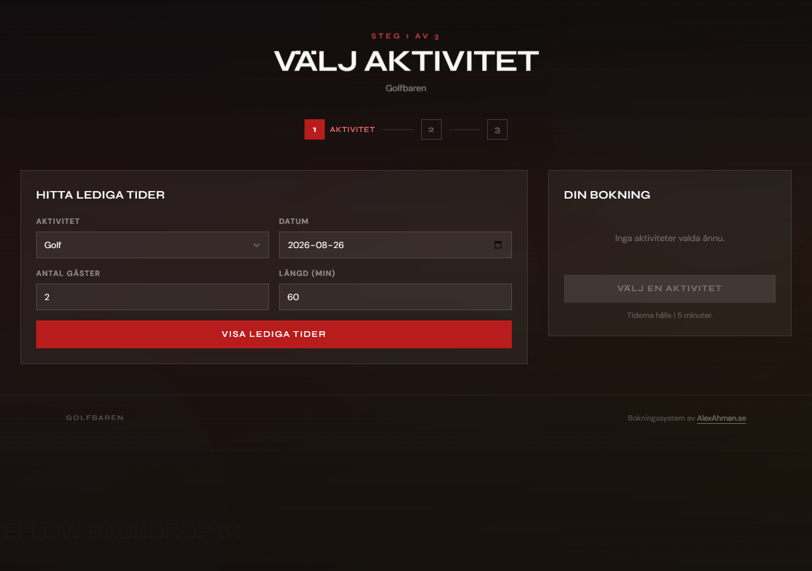
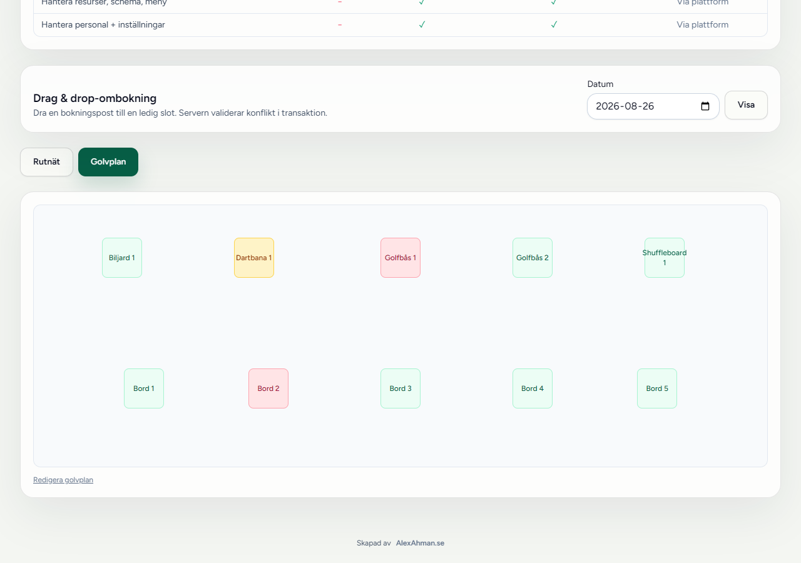
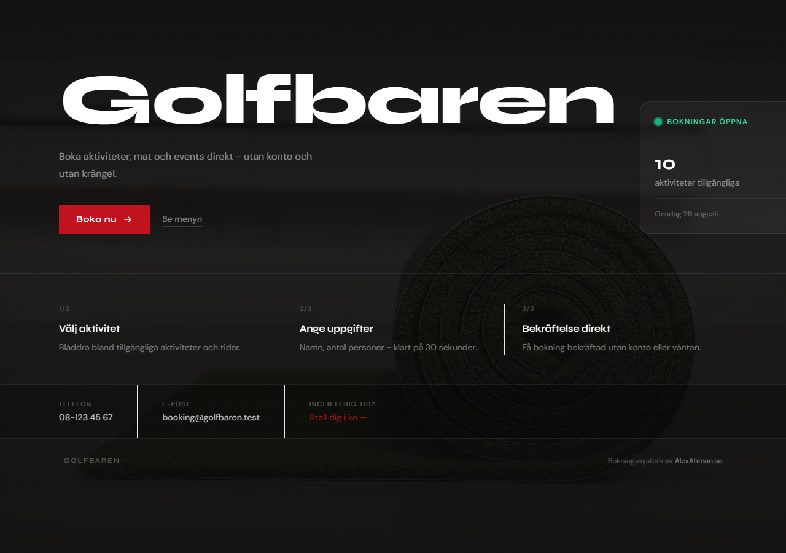
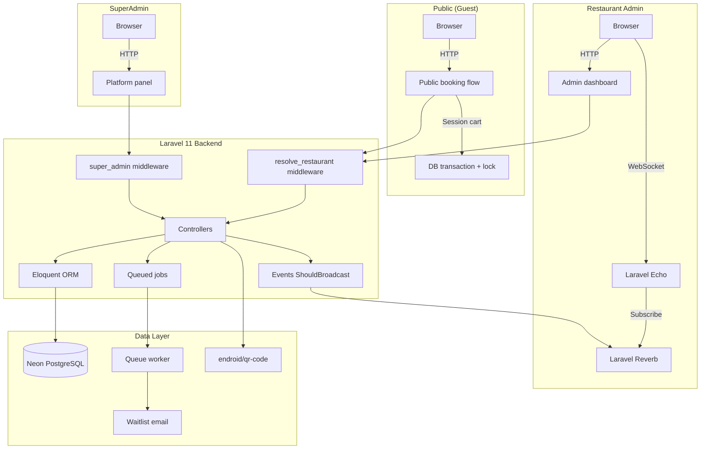

# VenueFlow

A multi-tenant venue booking system built as a portfolio project. Covers the full stack from public guest booking to real-time admin operations and platform management — including a drag-to-arrange visual floor plan for the live board, and an embeddable booking widget venues can put on their own website.

**Live demo:** [venueflow.alexahman.se](https://venueflow.alexahman.se)

---

## Screenshots

| Guest booking flow | Live board · visual floor plan |
|---|---|
|  |  |



---

## Architecture



**Request flow for public booking:**
1. Guest selects activity → items added to session cart
2. On confirm → DB transaction with `lockForUpdate()` checks slot availability
3. `BookingCreated` event dispatched → broadcasts via Reverb to admin live board
4. QR code PDF generated on demand

**Admin live board:**
- Subscribes to `restaurant.{id}.bookings` channel via Echo
- On `BookingCreated` / `BookingStatusUpdated` → live board reloads
- Drag-and-drop rebooking via `POST /bookings/{id}/items/{item}/move` with server-side conflict validation

---

## Stack

| Layer | Technology |
|---|---|
| Backend framework | Laravel 11, PHP 8.3 |
| Database | Neon (managed serverless PostgreSQL) |
| WebSockets | Laravel Reverb (first-party, self-hosted) |
| Frontend | Blade templates, Alpine.js, Tailwind CSS v3 |
| Asset pipeline | Vite |
| QR codes | endroid/qr-code (pure PHP, no ext-gd) |
| Hosting | Render (web service + background worker) |

---

## Multi-tenancy

Each restaurant is a **tenant**. The `resolve_restaurant` middleware reads the `{slug}` route parameter, looks up the restaurant, and binds it to the request. The `restaurant_member` middleware gates admin access by checking the authenticated user's membership role (`OWNER`, `MANAGER`, `STAFF`) against the resolved restaurant.

```
/r/{slug}/          → public guest flow (no auth)
/r/{slug}/admin/    → restaurant admin (auth + membership)
/platform/          → superadmin (auth + is_super_admin flag)
```

---

## Key design decisions

**Why Laravel Reverb instead of Pusher?**
First-party, self-hosted, zero external dependency. Identical Echo client API, no API key to manage, no usage limits.

**Why Neon instead of plain PostgreSQL?**
Managed, serverless hosting that scales to zero on inactivity and wakes automatically on the next request — no manual "resume" step and no free-tier active-project cap to run into, unlike Supabase's free tier. Use the direct (non-pooled) connection string for `DB_HOST`, not the `-pooler` host: Neon's pgbouncer pooler runs in transaction-pooling mode, which can silently abort Laravel's multi-statement migration transactions (`SQLSTATE[25P02]`) if the pooler reassigns the backend connection mid-transaction.

**Why Alpine.js instead of React/Vue?**
The admin UI is server-rendered Blade. Alpine adds interactivity without a SPA build or hydration overhead. The live board only needs `x-data` + WebSocket event handling — React would be overkill.

**Why session-based booking cart instead of database rows?**
Avoids orphaned partial bookings from abandoned sessions. The cart lives in PHP session; only a completed booking hits the database.

---

## Running locally

```bash
# 1. Clone and install
git clone https://github.com/AlexAhmanHV/VenueFlow.git
cd VenueFlow/app
composer install
npm install

# 2. Configure
cp .env.example .env
php artisan key:generate
# Fill in DB_*, REVERB_* in .env

# 3. Migrate and seed
php artisan migrate --seed

# 4. Start services (separate terminals)
php artisan serve
php artisan reverb:start
php artisan queue:work
npm run dev
```

Visit `http://localhost:8000`

---

## Demo

| Role | URL | Credentials |
|---|---|---|
| Guest | `/r/golfbaren` | No login |
| Restaurant admin | `/r/golfbaren/admin/dashboard` | `owner@demo.test` / `password` |
| SuperAdmin | `/platform/restaurants` | Requires full-access key |

Demo credentials on the [demo hub](https://venueflow.alexahman.se).

---

Built by [Alex Ahman](https://alexahman.se)
